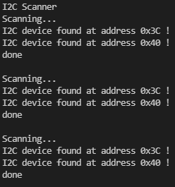

# PRACTICA 5 : Buses de comunicación I (introducción y I2c)


## 5.1:  _ESCÁNER I2C_

- CÓDIGO:
```cpp
#include <Arduino.h>
#include <Wire.h>
void setup()
{
Wire.begin();
Serial.begin(115200);
while (!Serial); // Leonardo: wait for serial monitor
Serial.println("\nI2C Scanner");
}
void loop()
{
byte error, address;
int nDevices;
Serial.println("Scanning...");
nDevices = 0;
for(address = 1; address < 127; address++ )
{
// The i2c_scanner uses the return value of
// the Write.endTransmisstion to see if
// a device did acknowledge to the address.
Wire.beginTransmission(address);
error = Wire.endTransmission();
if (error == 0)
{
Serial.print("I2C device found at address 0x");
if (address<16)
Serial.print("0");
Serial.print(address,HEX);
Serial.println(" !");
nDevices++;
}
else if (error==4)
{
Serial.print("Unknown error at address 0x");
if (address<16)
Serial.print("0");
Serial.println(address,HEX);
}
}
if (nDevices == 0)
Serial.println("No I2C devices found\n");
else
Serial.println("done\n");
delay(5000); // wait 5 seconds for next scan
}

```

- SALIDA POR EL PUERTO SERIE:
  
  Al ejecutar el programa, este nos mustra por el monitor como se hace un Scanner de dispositivos I2C y se muestra la dirección de ese dispositivo en formato HEX (Hexadecimal), si no hubiese encontrado ningún dispositivo, el programa hubiese monitoreador :'No I2C devices found'.

  
  
- FUNCIONAMIENTO:
  
  Para el montaje de un dispositivo I2C a la ESP32, se asocia de la siguiente manera:

    | I2C Device | ESP32                    |
    | ---------- | ------------------------ |
    | SDA        | SDA (default is GPIO 21) |
    | SCL        | SCL (default is GPIO 22) |
    | GND        | GND                      |
    | VCC        | usually 3.3V or 5V       |

Para este programa declaramos las librerias de Arduino y de Wire.
```cpp
#include <Arduino.h>
#include <Wire.h>
```
En el SetUp inicializamos el Wire y el Serial con el .begin, para el Serial ponemos el monitor speed a 115200. Entoces creamos un buvle que sea que mientras no detecte el Serial monitor, que imprima por pantalla 'I2C Scanner'. Esto último en principio sólo lo tiene que imprimir una vez, al inicializar el programa.


```cpp
void setup()
{
Wire.begin();
Serial.begin(115200);
while (!Serial); // Leonardo: wait for serial monitor
Serial.println("\nI2C Scanner");
}
```
Ahora en el Loop, declaramos las variables tipo byte 'error' y 'address' y de tipo int 'nDevices'.
Se hace un println por el monitor de Serial 'Scanning...', la variable 'nDevices' se inicia a 0, ya que será la variable que almacene el número de dispositivos I2c que se detectan.
Dentro de un bucle for, que itera desde address=1 hasta address < 127 ( ya que asi transcurre por los 8 bytes, 128 bits) se hace:
'Wire.beginTransmission(address);'
'error = Wire.endTransmission();' para guardar en 'error' si el dispositivo ha reconocido la 'address'.
Se usa esto de la siguiente manera:
- si 'error' == 0: que imprima que se ha encontrado un dispositivo I2C y la 'address' en la que se ha encontrado en Hexadecimal.
- si 'error' == 4: imprime que ha habido un error desconocido y en la 'address' que lo ha detectado

Fuera del for, se comprueba el numero de dispositivos encontrados con la variable nDevices, que si esta es 0, entonces se imprime que no se ha encontrado ninfgún dispositivo I2C.

```cpp
void loop()
{
byte error, address;
int nDevices;
Serial.println("Scanning...");
nDevices = 0;
for(address = 1; address < 127; address++ )
{
// The i2c_scanner uses the return value of
// the Write.endTransmisstion to see if
// a device did acknowledge to the address.
Wire.beginTransmission(address);
error = Wire.endTransmission();
if (error == 0)
{
Serial.print("I2C device found at address 0x");
if (address<16)
Serial.print("0");
Serial.print(address,HEX);
Serial.println(" !");
nDevices++;
}
else if (error==4)
{
Serial.print("Unknown error at address 0x");
if (address<16)
Serial.print("0");
Serial.println(address,HEX);
}
}
if (nDevices == 0)
Serial.println("No I2C devices found\n");
else
Serial.println("done\n");
delay(5000); // wait 5 seconds for next scan
}
```